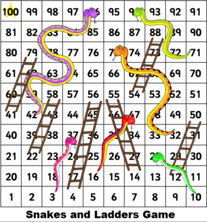

This is my attempt on a practice question at hackerrank:

## Question

### Snakes and Ladders: The Quickest Way Up

Markov takes out his Snakes and Ladders game, stares at the board and wonders: "If I can always roll the die to whatever number I want, what would be the least number of rolls to reach the destination?"

Rules The game is played with a cubic die of 6 faces numbered 1 to 6
  
1. Starting from square 1 land on square 100, with the exact roll of the die. If moving the number rolled would place the player beyond square 100

no move is made.

2. If a player lands at the base of a ladder, the player must climb the ladder. Ladders go up only.

3. If a player lands at the mouth of a snake, the player must go down the snake and come out through the tail. Snakes go down only.

## My solution:

My solution is in python language.

This question was placed under graph theory sub-section. However, the question body itself didn't suggested anything about solving the question with graph theory, which encouraged my attempt to be using python `list` and recursion. (It is much simpler to understand and faster to implement than other solutions)

**Highlights**
* The best thing about this solution is that as more iterations happen, the recursion gets further optimised.
* The `next6` function also significantly contributes to optimisation, by eliminating about **75%** of combinations of moves, this approach lacks in BST solutions and other solutions that I came across.

A sample image

Output on one run:

Input:

> No. of testcases : 1           
No. of ladders : 6\
Ladder : 4 56\
Ladder : 22 58\
Ladder : 41 79\
Ladder : 14 55\
Ladder : 12 50\
Ladder : 54 88\
No. of snakes : 6\
Snakes : 37 3\
Snakes : 47 16\
Snakes : 28 10\
Snakes : 75 32\
Snakes : 94 71\
Snakes : 96 42\

Output:

> Min-moves : 6\
1 -> 7 -> 50 -> 88 -> 93 -> 99 -> 100

Explaination of the output:

The first die roll will be **6**, bot will go from `1` to `7`
The second die roll will be **5**, bot will go from `7` to `12` , and a ladder from `12` leads to `50`
The third die roll will be **4**, bot will go from `50` to `54`, and a ladder from `54` leads to `88`
The fourth die roll will be **5**, bot will go to `93`. (It doesn't roll a **6**, as there is a snake on `94`)
The fifth die roll will be **6**, bot will go to `99`.
The sixth die roll will be **1**, bot will reach `100`.

Now there could be other solution with 6 moves, the solution covers them, but doesn't print them. The program can be tweaked a little bit to print all the solutions.
